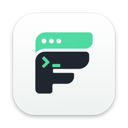
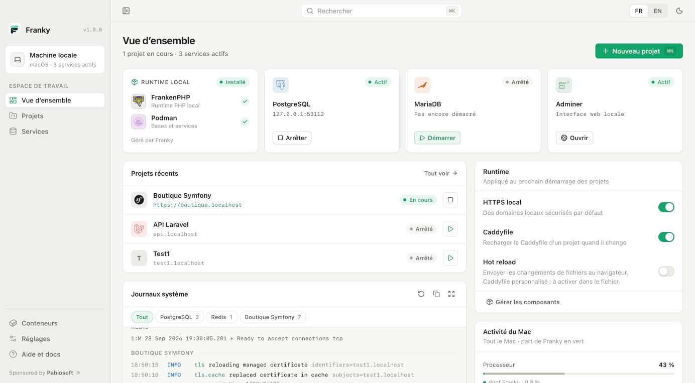
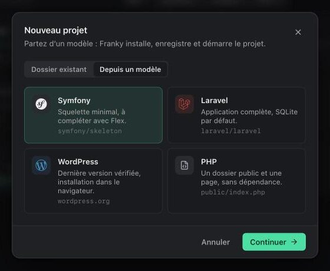
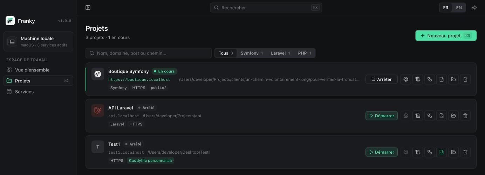
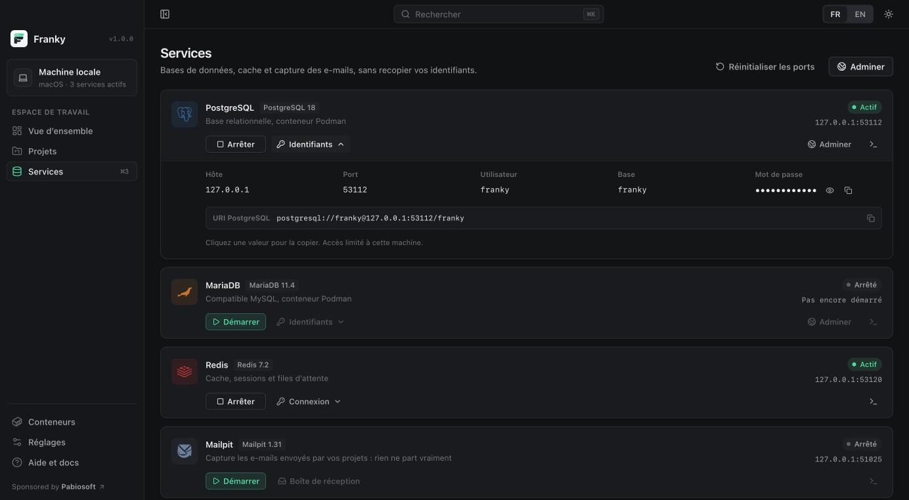
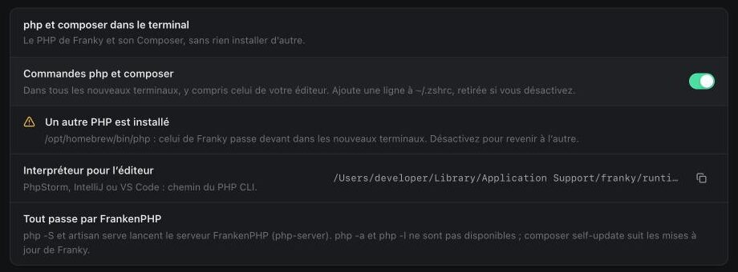
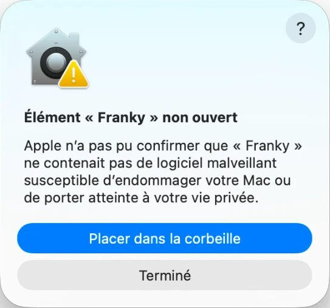
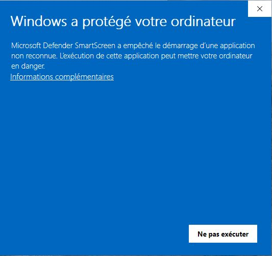
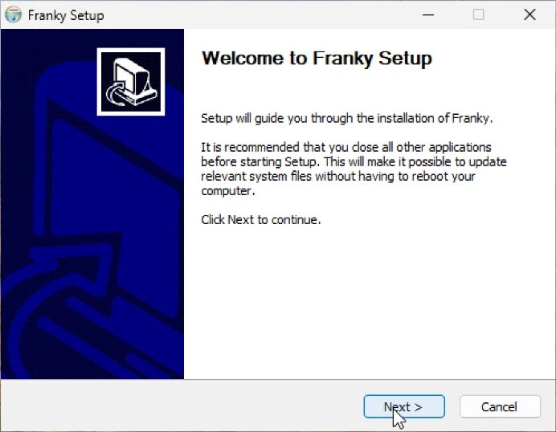
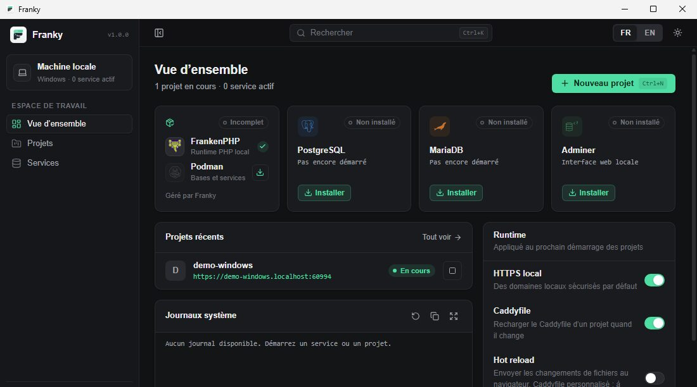

<p align="center">
  
</p>

<h1 align="center">Franky</h1>

<p align="center">
  Tout l’écosystème PHP en local, prêt en un clic, sur macOS et Windows.
</p>

<p align="center">
  <a href="https://github.com/pabiosoft/franky/releases/latest"><b>Télécharger</b></a>
  &nbsp;·&nbsp;
  <a href="#fonctionnalités">Fonctionnalités</a>
  &nbsp;·&nbsp;
  <a href="#installer">Installer</a>
  &nbsp;·&nbsp;
  <a href="#premiers-pas">Premiers pas</a>
  &nbsp;·&nbsp;
  <a href="#questions-fréquentes">Questions</a>
  &nbsp;·&nbsp;
  <a href="#aide">Aide</a>
</p>

<p align="center">
  <a href="https://github.com/pabiosoft/franky/releases/latest"></a>
  
</p>

<picture>
  <source media="(prefers-color-scheme: dark)" srcset=".github/assets/apercu-sombre.jpg">
  
</picture>

Franky installe [FrankenPHP](https://frankenphp.dev) et les services dont vos projets ont besoin, puis les sert en HTTPS sur un domaine `*.localhost`. Sans Docker Compose, sans fichier de configuration à écrire.

## Fonctionnalités

<table>
  <tr>
    <td width="50%" valign="top">
      <h3>Vos projets, tout de suite</h3>
      Ajoutez un dossier existant ou partez d’un modèle <b>Symfony</b>, <b>Laravel</b>, <b>WordPress</b> ou <b>PHP</b>. Franky détecte le framework, sert son dossier public et lui donne une adresse comme <code>https://boutique.localhost</code>.
    </td>
    <td width="50%" valign="top">
      
    </td>
  </tr>
  <tr>
    <td width="50%" valign="top">
      
    </td>
    <td width="50%" valign="top">
      <h3>HTTPS local sans avertissement</h3>
      Un certificat par projet, signé par une autorité créée sur votre ordinateur. Approuvez-la une fois : vos projets s’ouvrent ensuite avec le cadenas. Démarrez, arrêtez, ouvrez les journaux en un clic.
    </td>
  </tr>
  <tr>
    <td width="50%" valign="top">
      <h3>Bases de données à la demande</h3>
      <b>PostgreSQL</b>, <b>MariaDB</b>, <b>Redis</b> et <b>Mailpit</b> pour capturer les e-mails, avec <b>Adminer</b>. Chaque base garde son port, et les identifiants se copient en un clic.
    </td>
    <td width="50%" valign="top">
      
    </td>
  </tr>
  <tr>
    <td width="50%" valign="top">
      
    </td>
    <td width="50%" valign="top">
      <h3><code>php</code> et <code>composer</code> partout</h3>
      Le PHP de Franky et son Composer dans votre terminal et votre éditeur (PhpStorm, VS Code), sans rien installer d’autre. Workers de file d’attente et rechargement à chaud inclus.
    </td>
  </tr>
</table>

- **Tout reste sur votre ordinateur** : les services n’écoutent que sur `127.0.0.1`, les téléchargements sont vérifiés par empreinte SHA-256.
- **Mises à jour intégrées** : Franky vous prévient d’une nouvelle version et l’installe en un clic, après en avoir vérifié la signature.
- **En français et en anglais**, en thème clair ou sombre.

## Installer

Sur la page de la [dernière version](https://github.com/pabiosoft/franky/releases/latest), téléchargez le fichier qui correspond à votre ordinateur :

| Système | Fichier |
| --- | --- |
| macOS, Mac Apple Silicon (M1 et suivants) | `Franky_<version>_macos-apple-silicon.dmg` |
| macOS, Mac Intel | `Franky_<version>_macos-intel.dmg` |
| Windows 10 et 11 (64 bits) | `Franky_<version>_windows-x64-setup.exe` |

> [!NOTE]
> Franky n’est pas encore signé par Apple ni par Microsoft : chaque système affiche un avertissement au **premier** lancement. C’est attendu, et on ne le fait qu’une fois. Les versions suivantes s’installent depuis Franky (Réglages › Mises à jour).

<details>
<summary><b>macOS</b> : installer et ouvrir Franky</summary>
<br>

1. Ouvrez le `.dmg` et glissez **Franky** dans **Applications**.
2. Ouvrez Franky depuis **Applications** (pas depuis la fenêtre du `.dmg`). macOS indique qu’il ne peut pas vérifier l’app : cliquez sur **Terminé**, pas sur *Placer dans la corbeille*.

   

3. Ouvrez **Réglages Système › Confidentialité et sécurité**, descendez jusqu’à « Franky a été bloqué » et cliquez sur **Ouvrir quand même**, puis confirmez avec votre mot de passe.
4. Relancez Franky depuis **Applications**. Vous pouvez ensuite éjecter le `.dmg`.

Ne désactivez pas Gatekeeper pour tout le Mac : ce n’est pas nécessaire.

</details>

<details>
<summary><b>Windows</b> : installer et ouvrir Franky</summary>
<br>

1. Lancez `Franky_<version>_windows-x64-setup.exe`. Si SmartScreen affiche « Windows a protégé votre ordinateur », cliquez sur **Informations complémentaires**, puis **Exécuter quand même**.

   

2. Suivez l’assistant (**Next**, **Install**, **Finish**). L’installation se fait pour votre compte, sans droits administrateur.

   

3. Franky s’ouvre. Il reste disponible dans la barre des tâches, parmi les icônes cachées (^), même quand sa fenêtre est fermée.

   

</details>

<details>
<summary><b>Vérifier le téléchargement</b> (facultatif)</summary>
<br>

Chaque version publie `SHA256SUMS.txt`. L’empreinte de votre fichier doit y figurer à l’identique :

- macOS : `shasum -a 256 Franky_*.dmg`
- Windows (PowerShell) : `Get-FileHash .\Franky_*-setup.exe`

</details>

## Premiers pas

1. **Choisissez votre stack** au premier lancement : *Symfony / Laravel*, *WordPress* ou *PHP seul*. Franky télécharge et vérifie ce qu’il faut.
2. **Ajoutez un projet** : *Nouveau projet* (<kbd>⌘N</kbd> sur Mac, <kbd>Ctrl+N</kbd> sous Windows), puis un dossier existant ou un modèle.
3. **Approuvez le certificat local** quand Franky le propose : vos projets s’ouvrent ensuite en HTTPS sans avertissement.
4. **Activez `php` et `composer`** dans Réglages › Terminal, puis ouvrez un nouveau terminal :

   ```bash
   php -v
   composer -V
   ```

La page **Aide et docs** de l’app contient des guides pas à pas : bases de données, e-mails, workers, HTTPS, rechargement à chaud.

## Questions fréquentes

<details>
<summary><b>Faut-il Docker ?</b></summary>
<br>
Non. Les projets PHP tournent avec FrankenPHP, installé par Franky. Les bases de données utilisent <a href="https://podman.io">Podman</a>, que Franky propose d’installer : avec Homebrew sur macOS, avec winget sur Windows (où Podman a aussi besoin de WSL 2). Pour des projets sans base, FrankenPHP suffit.
</details>

<details>
<summary><b>Mes projets sont-ils accessibles depuis le réseau ?</b></summary>
<br>
Non. Franky n’écoute que sur <code>127.0.0.1</code> : vos projets et vos bases ne sont visibles que depuis votre ordinateur.
</details>

<details>
<summary><b>J’ai déjà PHP (Homebrew, XAMPP, MAMP…). Est-ce que ça pose problème ?</b></summary>
<br>
Non. Franky utilise son propre PHP. Si vous activez ses commandes <code>php</code> et <code>composer</code>, elles passent devant dans les nouveaux terminaux ; désactivez-les pour revenir à votre PHP habituel. Franky vous signale l’autre PHP qu’il a trouvé.
</details>

<details>
<summary><b>Que se passe-t-il quand je ferme la fenêtre ?</b></summary>
<br>
Franky reste ouvert dans la barre des menus (macOS) ou la barre des tâches (Windows), et vos projets restent en ligne. <b>Quitter Franky</b>, depuis son icône, arrête tout proprement. Au lancement suivant, il peut reprendre ce qui tournait (Réglages › Démarrage).
</details>

<details>
<summary><b>Comment désinstaller Franky ?</b></summary>
<br>
Quittez Franky, puis supprimez l’app (macOS : glissez-la de Applications vers la Corbeille ; Windows : Paramètres › Applications › Franky › Désinstaller). Avant, désactivez dans Franky ce que vous aviez activé : <code>php</code> et <code>composer</code> (Réglages › Terminal) et l’ouverture à la connexion (Réglages › Démarrage).
</details>

## Aide

- **Dans l’app** : *Aide et docs* pour les guides et les problèmes courants, *Réglages › Journaux système* pour comprendre une erreur.
- **Un bug, une idée** : ouvrez une [issue](https://github.com/pabiosoft/franky/issues) en précisant votre système, la version de Franky et, si possible, les journaux.

---

<p align="center">
  Développé par <a href="https://pabiosoft.com">Pabiosoft</a>.<br>
  <sub>FrankenPHP, Podman, PostgreSQL, MariaDB, Redis, Mailpit et Adminer sont des projets tiers, téléchargés depuis leurs sources officielles.</sub>
</p>
